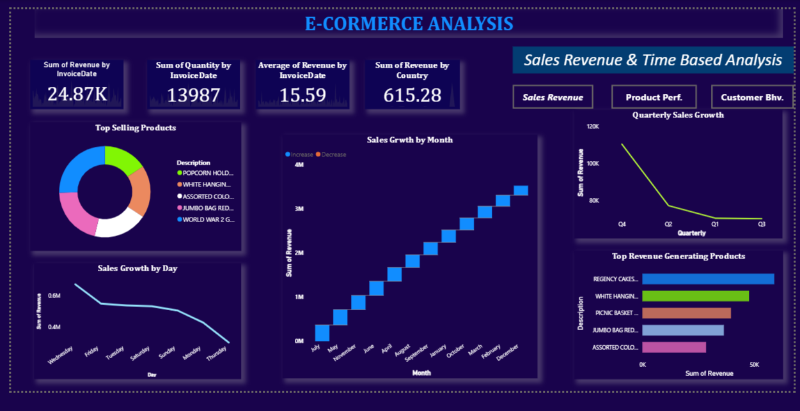

# 📊 Simple Dashboard Project

This project is a **data dashboard** built to visualize and track key metrics. It provides an interactive way to explore information such as sales, expenses, and performance trends.

### Dashboard Overview

### Sales Performance

### Mobile View

---

## 🛠️ Tech Stack
- **Frontend:** HTML, CSS, JavaScript
- **Charts:** Chart.js / Recharts
- **Backend (optional):** Node.js / Python Flask
- **Database (optional):** SQLite / PostgreSQL

---

## 📂 Project Structure
